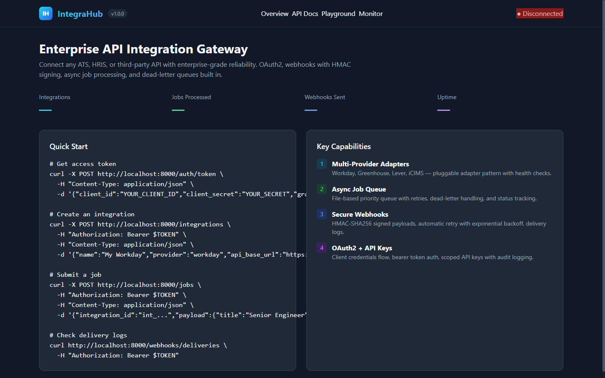
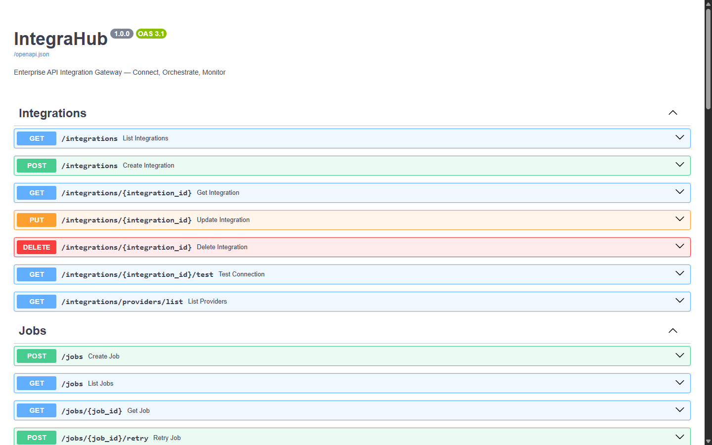

# IntegraHub — Enterprise API Integration Gateway

[](https://github.com/crwz46/integrahub/actions)
[](https://python.org)
[](https://fastapi.tiangolo.com)
[](LICENSE)

**IntegraHub** is a production-ready API integration gateway built with FastAPI. It demonstrates enterprise integration patterns for connecting ATS, HRIS, and third-party APIs — exactly the kind of system used by integration engineers at companies like Integrity Indonesia.

## Screenshots

| Developer Portal | API Docs (Swagger) | API Docs (ReDoc) |
|---|---|---|
|  |  |  |

## Features

### Core Capabilities

| Feature | Description |
|---------|-------------|
| **Multi-Provider Adapters** | Pluggable adapter pattern supporting Workday, Greenhouse, Lever, iCIMS, Custom |
| **Async Job Queue** | File-based priority queue with retries, DLQ, and real-time status tracking |
| **Webhook Engine** | HMAC-SHA256 signing, exponential backoff retry, dead-letter queue, delivery logs |
| **OAuth2 + API Keys** | Client credentials flow, JWT tokens, scoped API keys with audit |
| **Developer Portal** | Built-in dashboard with live stats, API playground, system monitor |
| **File Handling** | Upload/download with pre-signed URLs, content-type detection |
| **Rate Limiting** | Configurable per-IP rate limiting with Retry-After headers |
| **Error Handling** | Global error middleware with debug mode, structured error responses |

### Architecture

```
┌──────────────┐     ┌──────────────────┐     ┌──────────────┐
│  Developer   │────▶│   IntegraHub     │────▶│  Workday      │
│  Portal      │     │   Gateway         │     │  Greenhouse   │
│  (HTML/JS)   │     │   (FastAPI)       │     │  Lever        │
└──────────────┘     │                  │     │  iCIMS        │
                     │  ┌────────────┐  │     │  Custom       │
                     │  │ Rate Limit │  │     └──────────────┘
                     │  │ Middleware │  │
                     │  └────────────┘  │     ┌──────────────┐
                     │  ┌────────────┐  │────▶│  Webhooks     │
                     │  │   Queue    │  │     │  (HMAC+Retry) │
                     │  │  Engine    │  │     │  + DLQ        │
                     │  └────────────┘  │     └──────────────┘
                     │  ┌────────────┐  │
                     │  │  Error     │  │
                     │  │  Handler   │  │
                     │  └────────────┘  │
                     └──────────────────┘
```

## Quick Start

```bash
# Clone
git clone https://github.com/crwz46/integrahub.git
cd integrahub

# Install
pip install -r requirements.txt

# Seed demo data
python scripts/seed_demo.py

# Run
uvicorn app.main:app --reload

# Open
open http://localhost:8000
```

Or with Docker:

```bash
docker compose up
```

## API Overview

### Authentication
```
POST /auth/token              # OAuth2 client credentials
POST /auth/api-keys           # Create API key
GET  /auth/api-keys           # List API keys
```

### Integrations
```
GET    /integrations              # List all integrations
POST   /integrations              # Create integration
GET    /integrations/{id}         # Get integration details
PUT    /integrations/{id}         # Update integration
DELETE /integrations/{id}         # Delete integration
GET    /integrations/{id}/test    # Test connection
GET    /integrations/providers/list  # List supported providers
```

### Jobs
```
POST  /jobs                  # Submit job for async processing
GET   /jobs                  # List jobs (?status=&page=&page_size=)
GET   /jobs/{id}             # Get job status & result
POST  /jobs/{id}/retry       # Retry failed job
GET   /jobs/stats/queue      # Queue stats (pending/processing/completed/failed)
```

### Webhooks
```
POST  /webhooks/register          # Register webhook subscription
GET   /webhooks/subscriptions     # List active subscriptions
DELETE /webhooks/subscriptions/{id}  # Remove subscription
GET   /webhooks/deliveries        # Delivery logs
POST  /webhooks/{id}/test         # Send test event
GET   /webhooks/dlq               # Dead-letter queue
POST  /webhooks/dlq/{id}/replay   # Replay failed delivery
```

### Reports
```
POST  /reports               # Generate integration report
GET   /reports               # List all reports
GET   /reports/{id}          # Get report details
```

### Files
```
POST  /files/upload          # Upload file
GET   /files/{id}            # Get file info
GET   /files/download/{id}   # Download file
```

### System
```
GET   /health                # System health + stats
```

## Full API Reference

Interactive docs at [/docs](http://localhost:8000/docs) (Swagger UI) or [/redoc](http://localhost:8000/redoc) (ReDoc).

## Example Workflow

```bash
# 1. Create a Workday integration
curl -X POST http://localhost:8000/integrations \
  -H "Content-Type: application/json" \
  -d '{"name":"Prod Workday","provider":"workday","api_base_url":"https://api.workday.com/v1"}'

# 2. Get access token (use client_id & client_secret from response)
curl -X POST http://localhost:8000/auth/token \
  -H "Content-Type: application/json" \
  -d '{"client_id":"ig_abc...","client_secret":"def...","grant_type":"client_credentials"}'

# 3. Submit a job
curl -X POST http://localhost:8000/jobs \
  -H "Authorization: Bearer eyJ..." \
  -H "Content-Type: application/json" \
  -d '{"integration_id":"int_abc...","payload":{"title":"Senior Engineer","location":"Jakarta"}}'

# 4. Register a webhook
curl -X POST http://localhost:8000/webhooks/register \
  -H "Authorization: Bearer eyJ..." \
  -H "Content-Type: application/json" \
  -d '{"url":"https://hooks.example.com/integrahub","events":["job.completed","job.failed"]}'

# 5. Generate report
curl -X POST http://localhost:8000/reports \
  -H "Authorization: Bearer eyJ..." \
  -H "Content-Type: application/json" \
  -d '{"integration_id":"int_abc..."}'
```

## Project Structure

```
integrahub/
├── app/
│   ├── main.py                # FastAPI app + developer portal (17KB HTML/JS)
│   ├── config.py              # Settings via pydantic-settings
│   ├── models.py              # Pydantic schemas (20+ models)
│   ├── api/
│   │   ├── integrations.py    # Integration CRUD + test connection
│   │   ├── jobs.py            # Job submission + async worker
│   │   ├── webhooks.py        # Webhook register/dispatch/DLQ
│   │   └── reports.py         # Analytics reports generator
│   ├── core/
│   │   ├── security.py        # OAuth2, JWT, HMAC-SHA256, API keys
│   │   ├── queue.py           # File-based priority queue
│   │   └── webhook_engine.py  # Webhook dispatch + retry + DLQ
│   └── adapters/
│       ├── base.py            # Abstract adapter interface
│       ├── workday.py         # Mock Workday adapter
│       ├── greenhouse.py      # Mock Greenhouse adapter
│       ├── lever.py           # Mock Lever adapter
│       └── icims.py           # Mock iCIMS adapter
├── scripts/
│   └── seed_demo.py           # Demo data seeder
├── tests/
│   ├── test_integrations.py   # 8 tests
│   ├── test_jobs.py           # 5 tests
│   ├── test_webhooks.py       # 5 tests
│   └── test_auth.py           # 3 tests
├── screenshots/
│   ├── portal.png
│   ├── swagger.png
│   └── redoc.png
├── .github/workflows/
│   └── ci.yml                 # GitHub Actions CI
├── Dockerfile
├── docker-compose.yml
├── .env.example
└── requirements.txt
```

## Running Tests

```bash
pytest tests/ -v
```

## Skills Demonstrated

- **REST API Design** — OpenAPI 3.0, versioning, structured error responses
- **OAuth2 + JWT** — Client credentials flow, token validation, scoped API keys
- **Webhook Engineering** — HMAC-SHA256 signing, exponential backoff retry, DLQ
- **Pluggable Architecture** — Strategy pattern for multi-provider adapters
- **Async Processing** — File-based priority queue with worker loop
- **Middleware** — Rate limiting, global error handling, CORS, request logging
- **Developer Experience** — Interactive portal, OpenAPI docs, playground
- **File Handling** — Upload, download, pre-signed URLs
- **Docker** — Multi-stage build, compose orchestration
- **CI/CD** — GitHub Actions, automated testing
- **Test Coverage** — 21 tests across auth, integrations, jobs, webhooks
- **Security** — HMAC comparison, JWT expiry, rate limiting, secret management

## License

MIT — built by [crwz46](https://github.com/crwz46) as a portfolio project.
